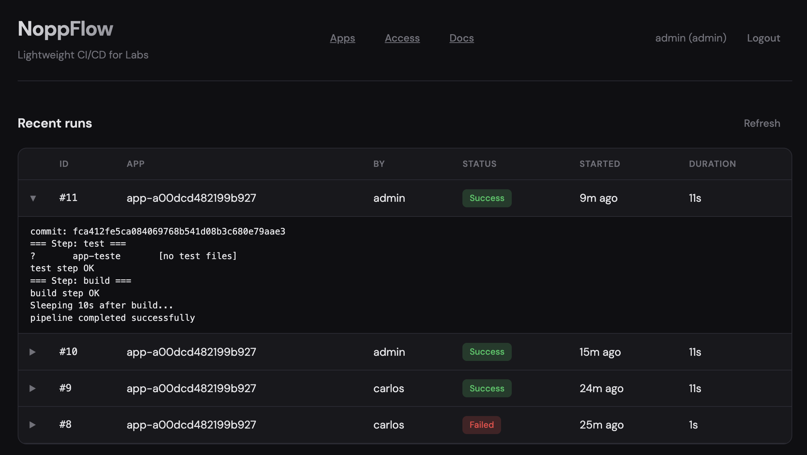
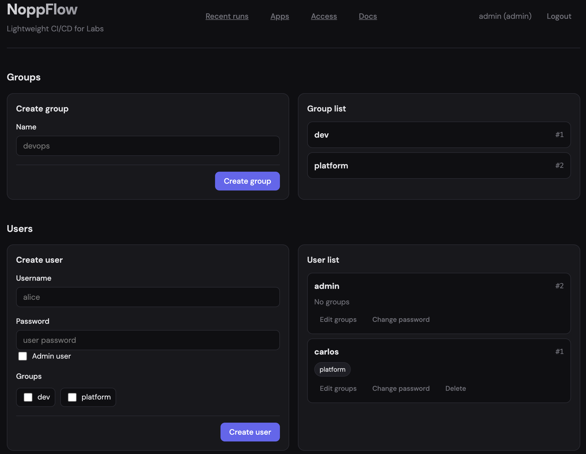
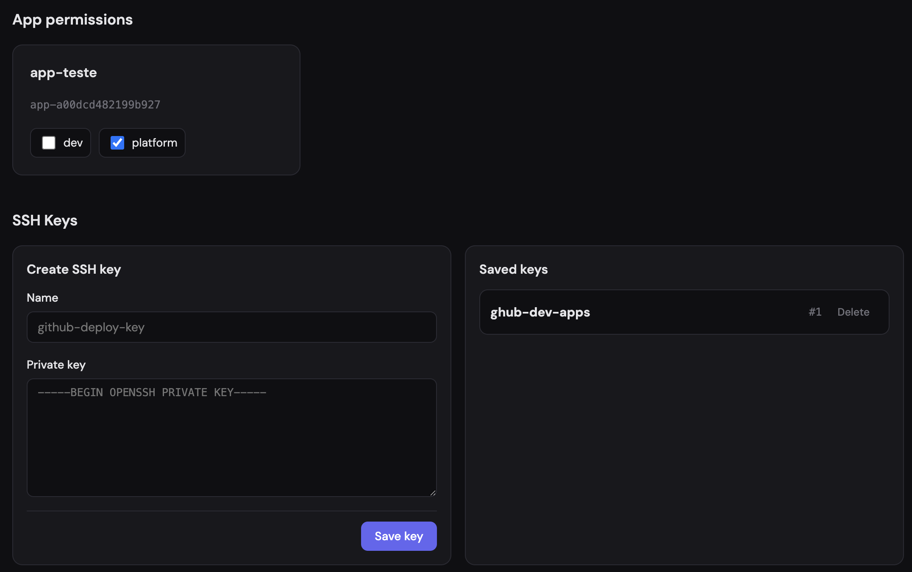

# NoppFlow

Minimal CI/CD system in Go with app-level access control by groups.
Supports SQLite (dev) and MySQL (prod).

### ---> Not finished yet! <---

## Quick Start

```bash
make tidy
make run-dev
```

Server runs at `http://localhost:8080`.

Default login:
- Username: `admin`
- Password: `admin`

You can override bootstrap admin credentials with:
- `ADMIN_USERNAME`
- `ADMIN_PASSWORD`

## Run Modes

- `make run-dev` (or `make run`): uses SQLite at `data/cicd.db`
- `make run-prod`: uses MySQL (set `DB_DSN`)

MySQL example:

```bash
export DB_DSN='user:password@tcp(host:3306)/dbname?parseTime=true'
make run-prod
```

## Authentication and Access Model

- Login is required for API and UI features.
- Sessions are cookie-based (`HttpOnly`).
- `admin` users can manage users, groups, app-group bindings, app lifecycle, SSH keys, and global env vars.
- Non-admin users can:
  - view only apps allowed by their groups
  - run allowed apps
  - edit allowed apps
  - view only runs of allowed apps
  - change their own password

## Web UI

Main pages:
- `/login.html` — login
- `/` — recent runs
- `/apps.html` — apps list and app actions
- `/app-form.html` — app create/edit (full pipeline and deploy settings)
- `/profile.html` — current user profile (name, groups, accessible repos/apps, change password)
- `/access.html` — admin-only access management (users, groups, app permissions)
- `/group.html?group_id=<id>` — admin-only group detail editor (members and apps)
- `/docs.html` — project docs page

Frontend stack:
- Static HTML pages
- Custom CSS (`web/css/style.css`)
- Vanilla JavaScript (`web/js/app.js`)
- No UI/layout framework (no React/Vue/Bootstrap/Tailwind UI)

Layout notes:
- Custom control-plane style dashboard (inspired by DevOps UIs).
- Light/dark theme toggle with local persistence.
- Shared sidebar/header navigation across main pages.

Notes:
- The `Access` link is hidden for non-admin users.
- If a non-admin directly opens admin-only pages, content is not shown.

## Pipeline Behavior

Each run executes app-defined `steps` in order.
Each step has:
- `name`
- exactly one of: `cmd`, `file`, `script`, `k8s_deploy`
- optional `sleep_sec` (0..3600)

Global env vars (admin-managed) are injected into all step executions, so `cmd` and `script` can use them directly (e.g. `$API_BASE_URL`).
In Access, global env var values are masked by default and can be revealed with `Show values`.
NoppFlow also injects `NOPPFLOW_RUN_ID` in each run, so you can create per-run image tags (e.g. `run-$NOPPFLOW_RUN_ID`).

Before steps, NoppFlow clones or pulls the app repository into `work/<app_id>/`.
Git clone/pull uses the app's configured SSH key (`ssh_key_name`).
If any step fails, run status becomes `failed`.

For `k8s_deploy` steps, app deploy settings are used and NoppFlow runs an ephemeral Kubernetes Job per run:
- `deploy_mode`: `kubectl` or `helm`
- `k8s_namespace`
- `k8s_service_account` (RBAC reference)
- `k8s_runner_image` (container image used by ephemeral Job runner)
- `deploy_manifest_path` (required for `kubectl`)
- `helm_chart` (required for `helm`)
- optional `helm_values_path`

Recent runs live UX:
- Runs list auto-refreshes while there are active runs.
- Expanded inline log auto-follows newest lines during execution.
- After run completion, inline log stays open (no auto-collapse).
- Expanded run shows a step flow rail (waiting/running/success/failed).
- Step flow rail is sticky at the top of the log panel while log scrolls.

## App Configuration

Apps are stored in `config/apps.yaml`.

Example:

```yaml
apps:
  - id: app-1a2b3c4d5e6f7788
    name: My Service
    repo: git@github.com:org/my-service.git
    branch: main
    ssh_key_name: github-main
    deploy_mode: kubectl
    k8s_namespace: apps
    k8s_service_account: noppflow-runner
    k8s_runner_image: ghcr.io/your-org/noppflow-runner:latest
    deploy_manifest_path: k8s/
    steps:
      - name: test
        cmd: go test ./...
      - name: build
        cmd: go build -o bin/app .
      - name: deploy
        k8s_deploy: true
        sleep_sec: 5
```

Notes:
- App IDs are auto-generated by the server on create (`app-<hex>`).
- `ssh_key_name` must reference an existing SSH key created by admin.
- Legacy fields (`test_cmd`, `build_cmd`, `deploy_cmd`) are still accepted for backward compatibility.

## API

All API routes are under `/api`.

### Health

- `GET /health`

### Auth

- `POST /api/auth/login`
- `POST /api/auth/logout`
- `GET /api/auth/me`
- `PUT /api/auth/password` (change current user password)
- `GET /api/auth/profile` (current user profile, groups, accessible apps/repos)

### Apps

- `GET /api/apps`
- `POST /api/apps` (admin)
- `GET /api/apps/{appID}`
- `PUT /api/apps/{appID}` (admin or allowed non-admin)
- `DELETE /api/apps/{appID}` (admin)
- `GET /api/apps/{appID}/groups` (admin)
- `PUT /api/apps/{appID}/groups` (admin)
- `POST /api/apps/{appID}/run`

### SSH Keys (admin)

- `GET /api/ssh-keys`
- `POST /api/ssh-keys`
- `DELETE /api/ssh-keys/{keyID}`

### Global Env Vars (admin)

- `GET /api/env-vars`
- `POST /api/env-vars` (`name`, `value`)
- `PUT /api/env-vars/{envVarID}` (`name`, `value`)
- `DELETE /api/env-vars/{envVarID}`

### Runs

- `GET /api/runs?app_id=&limit=&offset=&page=`
- `GET /api/runs/{id}`

### Users (admin)

- `GET /api/users`
- `POST /api/users`
- `PUT /api/users/{userID}/groups`
- `PUT /api/users/{userID}/password`
- `DELETE /api/users/{userID}` (admin users cannot be deleted)

### Groups (admin)

- `GET /api/groups`
- `POST /api/groups`
- `GET /api/groups/{groupID}`
- `PUT /api/groups/{groupID}/users`
- `PUT /api/groups/{groupID}/apps`

## Data

SQLite default file: `data/cicd.db`

Main tables:
- `runs`
- `users` (`is_admin` included)
- `groups`
- `user_groups`
- `app_groups`
- `ssh_keys`
- `global_env_vars`

Important behavior:
- Deleting an app also deletes all runs for that app.

## Commands

- `make run` — run server
- `make build` — build binary to `bin/cicd`
- `make test` — run tests
- `make tidy` — `go mod tidy`
- `make kind-up-local` — bootstrap local kind environment for end-to-end testing
- `make kind-up-local-podman` — same bootstrap flow using Podman

## Local Kubernetes Testing

Use `k8s/setup-kind-local.sh` (or the make targets above) to create a full local test environment with kind:
- local registry
- `noppflow` + `noppflow-runner` images build/push
- namespaces and RBAC
- NoppFlow deploy + service
- seeded test app (`app-teste`)

See [k8s/README.md](k8s/README.md) for all options (`RESET_DATABASE`, `SEED_TEST_APP`, `APP_IMAGE_TAG`, Podman settings).

## Flags

When running `bin/cicd` or `go run ./cmd/cicd`:

- `-config` (default: `config/apps.yaml`)
- `-db` (default: `data/cicd.db`)
- `-work` (default: `work`)
- `-addr` (default: `:8080`)
- `-static` (default: `web`)

## Documentation

- [CODE.md](CODE.md) — package/file/function reference
- [k8s/RUNBOOK.md](k8s/RUNBOOK.md) — Kubernetes operations runbook (ephemeral Jobs)
- [k8s/APP-K8S-PASSO-A-PASSO.md](k8s/APP-K8S-PASSO-A-PASSO.md) — detailed PT-BR walkthrough to register an app and deploy to Kubernetes
- [k8s/APP-K8S-STEP-BY-STEP.md](k8s/APP-K8S-STEP-BY-STEP.md) — detailed English walkthrough to register an app and deploy to Kubernetes
- `/docs.html` — architecture and API docs in the web UI

## Screenshots

### Home



### Admin



